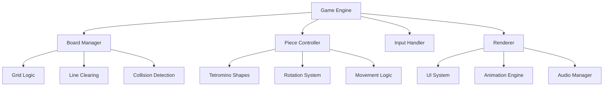

# Tetris-SFML: Modern Arcade Reimagined 🎮

<p align="center">
  
  
  
  
</p>

<p align="center">
  <strong>A high-performance, feature-complete recreation of the classic puzzle game with modern flair</strong>
</p>

<p align="center">
  
  <br>
  <em>Add your actual gameplay screenshot here after uploading!</em>
</p>

## ✨ **Features That Pop**

### 🎨 **Visual Excellence**
- **Polished UI**: Beautifully designed menus with smooth animations
- **Vibrant Game Boards**: Modern color schemes with particle effects
- **Ghost Piece Projection**: Visual guide for perfect placements
- **Dynamic Animations**: Smooth piece movement and line clearing effects

### 🎯 **Precision Gameplay**
- **Professional Mechanics**: Wall kicks, T-spins, and hard drops
- **Responsive Controls**: Ultra-low latency input handling
- **Dynamic Scoring**: Classic leveling system with increasing speed
- **Hold Piece Feature**: Strategic piece management

### 🔊 **Immersive Experience**
- **High-Fidelity Audio**: Custom sound effects and background music
- **Visual Feedback**: Screen shakes and particle effects on line clears
- **Themed Graphics**: Modern reinterpretation of classic tetromino designs

## 🏗️ **Technical Architecture**



## 📦 **Quick Installation**

### **Prerequisites**
- **SFML 2.5+** (Simple and Fast Multimedia Library)
- **C++17 compatible compiler** (GCC, Clang, or MSVC)
- **CMake 3.15+** (recommended)

### **Step-by-Step Setup**

#### **Option 1: Using CMake (Recommended)**
```bash
# Clone the repository
git clone https://github.com/ArifAli8866/Tetris-SFML.git
cd Tetris-SFML

# Create build directory
mkdir build && cd build

# Configure and build
cmake ..
cmake --build . --config Release

# Run the game
./Tetris-SFML
```

#### **Option 2: Manual Compilation**
```bash
# Compile with SFML
g++ -std=c++17 -I/path/to/sfml/include -c src/*.cpp
g++ *.o -o tetris -L/path/to/sfml/lib -lsfml-graphics -lsfml-window -lsfml-system -lsfml-audio

# On Linux, you might need to set library path
export LD_LIBRARY_PATH=/path/to/sfml/lib:$LD_LIBRARY_PATH
./tetris
```

### **Download SFML**
- **Windows**: [Download SFML](https://www.sfml-dev.org/download.php)
- **Linux**: `sudo apt-get install libsfml-dev`
- **macOS**: `brew install sfml`

## 🎮 **Control Scheme**

| Action | Key | Description |
|--------|-----|-------------|
| **Move** | ← → | Slide tetromino left/right |
| **Rotate** | ↑ / Z | Clockwise rotation |
| **Soft Drop** | ↓ | Gentle acceleration downward |
| **Hard Drop** | Space | Instant placement |
| **Hold** | C | Store current piece |
| **Pause** | P | Pause/resume game |
| **Restart** | R | Start new game |

## 🚀 **Compilation Scripts**

### **Windows (Batch)**
```batch
@echo off
g++ -std=c++17 -I"C:\SFML\include" -c src/*.cpp
g++ *.o -o Tetris.exe -L"C:\SFML\lib" -lsfml-graphics -lsfml-window -lsfml-system -lsfml-audio
Tetris.exe
```

### **Linux/macOS (Bash)**
```bash
#!/bin/bash
g++ -std=c++17 -I/usr/local/include -c src/*.cpp
g++ *.o -o tetris -L/usr/local/lib -lsfml-graphics -lsfml-window -lsfml-system -lsfml-audio
./tetris
```

## 📁 **Project Structure**
```
Tetris-SFML/
├── src/
│   ├── GameEngine.cpp      # Main game loop and state management
│   ├── Board.cpp          # Grid logic and line clearing
│   ├── Piece.cpp          # Tetromino shapes and rotation
│   ├── UI.cpp             # Menu system and HUD
│   └── AudioManager.cpp   # Sound effects and music
├── assets/
│   ├── textures/          # Game sprites and backgrounds
│   ├── fonts/             # Typography files
│   └── sounds/            # Audio files
├── include/               # Header files
└── CMakeLists.txt        # Build configuration
```

## 🤝 **Contributing**

We love your input! Want to contribute? Here's how:

1. **Fork** the project
2. **Create** your feature branch (`git checkout -b feature/AmazingFeature`)
3. **Commit** your changes (`git commit -m 'Add some AmazingFeature'`)
4. **Push** to the branch (`git push origin feature/AmazingFeature`)
5. **Open** a Pull Request

### **Areas for Contribution**
- 🎨 UI/UX improvements
- 🎵 Additional sound effects
- 🔧 Performance optimizations
- 🐛 Bug fixes and testing
- 📚 Documentation updates

## 📊 **Scoring System**

| Action | Points | Multiplier |
|--------|--------|------------|
| Single Line | 100 | × Level |
| Double Lines | 300 | × Level |
| Triple Lines | 500 | × Level |
| Tetris (4 lines) | 800 | × Level |
| T-Spin | 400 | × Level |
| Back-to-Back | 1.5× | Bonus |

## 🌟 **Upcoming Features**
- [ ] Online leaderboards
- [ ] Custom theme selector
- [ ] Replay system
- [ ] Challenge modes
- [ ] Mobile port (planned)

## 📞 **Support & Community**

Found a bug or have a suggestion? 
- 📧 **Email**: 2arif2143055@gmail.com
- 💼 **LinkedIn**: [Arif Ali](https://www.linkedin.com/in/arif-ali-23a38032a/)
- 🐛 **Issues**: [GitHub Issues](https://github.com/ArifAli8866/Tetris-SFML/issues)

## 📜 **License**
This project is licensed under the MIT License - see the [LICENSE](LICENSE) file for details.

## 🎯 **Credits & Acknowledgments**

- **SFML Community** for the amazing multimedia library
- **Original Tetris** by Alexey Pajitnov
- **Contributors** like you who make open source awesome!

---

<p align="center">
  Developed with ❤️ by <strong>Arif Ali</strong>
  <br>
  <a href="https://github.com/ArifAli8866">
    
  </a>
  <a href="https://www.linkedin.com/in/arif-ali-23a38032a/">
    
  </a>
</p>

<div align="center">
  
  [](https://github.com/ArifAli8866)
  [](https://github.com/ArifAli8866/Tetris-SFML/stargazers)
  [](https://github.com/ArifAli8866/Tetris-SFML/network/members)

</div>

---

**Happy Coding!** May your lines always clear and your tetrominos always fit. 🎮✨

---

## 🚀 **Quick Start for GitHub Upload**

Here are the exact commands to upload your project:

```bash
# 1. Initialize Git repository
git init

# 2. Add all your files
git add .

# 3. Make your first commit
git commit -m "Initial commit: Modern Tetris with SFML - Feature complete game with polished UI"

# 4. Link to your GitHub repository (create it first at https://github.com/new)
git remote add origin https://github.com/ArifAli8866/Tetris-SFML.git

# 5. Rename branch to main and push
git branch -M main
git push -u origin main
```
